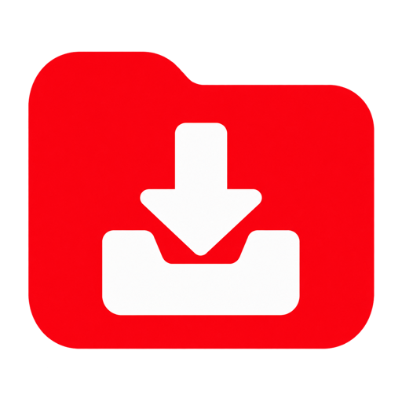

<p align="center"></p>

# YT Playlist Archiver

YT Playlist Archiver watches the YouTube playlists you choose and automatically archives new videos or audio on a schedule. Its browser dashboard lets you manage those playlist jobs, follow download activity, adjust common format and metadata settings, and sign in for private playlists such as Watch Later.

The application uses [ytdl-sub](https://github.com/jmbannon/ytdl-sub) as its download engine and focuses on scheduled YouTube playlist monitoring. It is not a complete graphical interface for every ytdl-sub feature.

The published images support `linux/amd64` and `linux/arm64`.

## Simple setup

Use [compose.simple.yaml](compose.simple.yaml) to start with public YouTube channels and playlists. It stores configuration and media in folders beside the Compose file and exposes the dashboard on port `8787`.

```yaml
name: yt-playlist-archiver

services:
  yt-playlist-archiver:
    image: ghcr.io/ukiews/yt-playlist-archiver:latest
    restart: unless-stopped
    user: "${PUID:-1000}:${PGID:-1000}"
    environment:
      TZ: "${TZ:-Etc/UTC}"
      YTDL_SUB_CONFIG_DIR: /config
      DASHBOARD_PASSWORD: "${DASHBOARD_PASSWORD:-admin1234}"
    ports:
      - "${DASHBOARD_PORT:-8787}:8787"
    volumes:
      - ./config:/config
      - ./media/videos:/media/videos
      - ./media/music:/media/music

  ytdl-sub:
    image: ghcr.io/jmbannon/ytdl-sub:latest
    restart: unless-stopped
    environment:
      PUID: "${PUID:-1000}"
      PGID: "${PGID:-1000}"
      TZ: "${TZ:-Etc/UTC}"
      CRON_SCHEDULE: "*/2 * * * *"
      CRON_RUN_ON_START: "false"
    volumes:
      - ./config:/config
      - ./media/videos:/media/videos
      - ./media/music:/media/music
```

Set `PUID`, `PGID`, `TZ`, and `DASHBOARD_PASSWORD` as project environment variables when their defaults are unsuitable. Ensure that the configured user can write to `./config`, `./media/videos`, and `./media/music`, then deploy the project and open `http://HOST-IP:8787`.

This minimal configuration does not include the Firefox authentication service. Use the full configuration below when Watch Later or another private playlist is required.

## Compose configuration

Use the repository's [compose.yaml](compose.yaml) for configurable host paths, bind addresses, dashboard ports, and the optional authentication browser. It defines:

- `ytdl-sub` for scheduled downloads
- `yt-playlist-archiver` for the dashboard
- An optional, stopped-between-uses Firefox service for YouTube authentication

Save [.env.example](.env.example) as `.env` beside `compose.yaml`, then set the values appropriate for the host:

| Variable | Purpose | Default |
| --- | --- | --- |
| `COMPOSE_PROJECT_NAME` | Stable name for this project | `yt-playlist-archiver` |
| `PUID` / `PGID` | Numeric owner of configuration and downloaded files | `1000` / `1000` |
| `TZ` | Container timezone | `Etc/UTC` |
| `CONFIG_DIR` | Persistent application configuration | `./config` |
| `VIDEO_DIR` | Downloaded video storage | `./media/videos` |
| `MUSIC_DIR` | Downloaded audio storage | `./media/music` |
| `DASHBOARD_BIND` | Host address for the dashboard | `0.0.0.0` |
| `DASHBOARD_PORT` | Dashboard port | `8787` |
| `DASHBOARD_PASSWORD` | Dashboard sign-in password | `admin1234` |

Create the host folders referenced by those paths and ensure `PUID:PGID` can write to them. Relative paths are resolved from the project directory. NAS shared-folder paths can be used directly.

Deploy the Compose project, then open:

```text
http://HOST-IP:8787
```

On the first start, the dashboard creates a working `config.yaml`, an empty `subscriptions.yaml`, four schedule groups, and the authentication check. The scheduler waits for that initialization before starting.

## Add a subscription

Open **Subscriptions → + Add** and enter:

- A unique subscription ID
- Video or audio
- A YouTube channel or playlist URL
- A destination beginning with `/media/videos/` or `/media/music/`
- A schedule group
- Optional genre, format, artwork, and metadata settings

The container paths `/media/videos/` and `/media/music/` map to `VIDEO_DIR` and `MUSIC_DIR` from the Compose configuration.

The starter schedule groups check every 2, 10, 30, and 1440 minutes. Change their intervals under **Configuration → Scheduler**. `CRON_SCHEDULE` controls how often the container wakes to evaluate which groups are due.

## Watch Later authentication

Public subscriptions require no browser. Watch Later and other private playlists use the optional Firefox service declared under the `youtube-auth` Compose profile.

Set these values for the project:

```dotenv
DOCKER_GID=123
FIREFOX_CONFIG_DIR=./firefox
FIREFOX_BROWSER_URL=http://HOST-IP:5800/
FIREFOX_CONTAINER_NAME=yt-playlist-archiver-firefox
```

`DOCKER_GID` must match the group that owns `/var/run/docker.sock` on the host. Create the Firefox service with the `youtube-auth` profile once. Its restart policy is `no`, so the dashboard can start it only when a sign-in refresh is needed.

In **YouTube sign-in**:

1. Start the sign-in browser.
2. Open the Firefox link and sign in to the YouTube account that owns Watch Later.
3. Return to the dashboard and import the Firefox sign-in.

The dashboard copies only YouTube cookies, verifies Watch Later access, and stops Firefox after a successful import. The persistent browser profile remains in `FIREFOX_CONFIG_DIR` while the stopped container uses no active CPU or memory.

The Docker socket mount permits the dashboard to start and stop Firefox. Keep the dashboard on a trusted network and change its default password.

## Updating

Redeploy the same Compose project after pulling the current images. All application state and downloaded media remain in the mounted host folders.

Keep `COMPOSE_PROJECT_NAME` unchanged for an existing project. The two core services have no fixed container names, which allows Compose to replace them normally during updates.

## Dashboard features

- Audio and video subscriptions with individual and global pause controls
- Manual and scheduled runs with live item transfer progress and persistent download history
- Editable folders, genres, source URLs, formats, tags, naming templates, and intervals
- Guided format controls and a raw yt-dlp expression option
- Watch Later authentication without returning cookie contents through the API
- Timestamped configuration backups
- Light and dark modes

## Releases

Images are published to:

```text
ghcr.io/ukiews/yt-playlist-archiver:latest
```

Version history is recorded in [CHANGELOG.md](CHANGELOG.md). Releases receive matching `vX.Y.Z` image tags.
